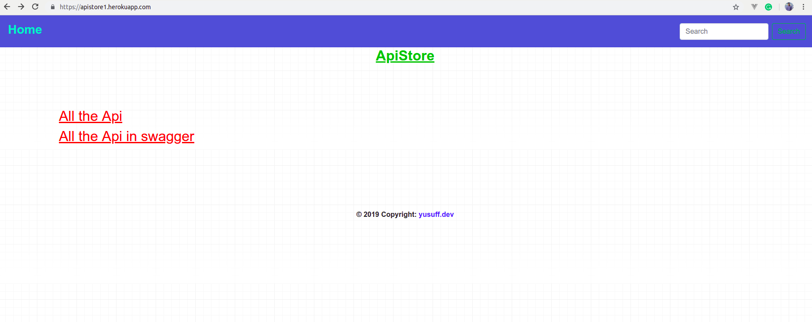
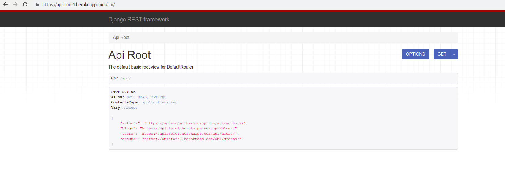
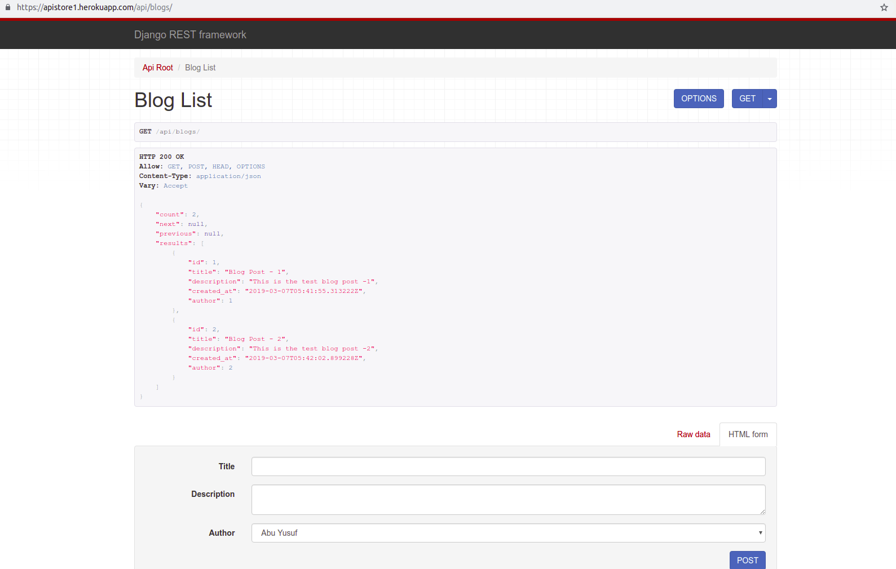
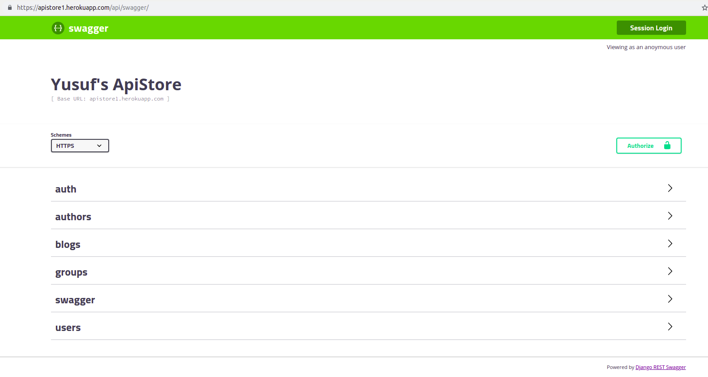

# Awesome-Rest(DRF)

## Project Installation

```
1. Clone the project
2. Activate your env
3. Go to root dir and run: pip install -r requirements.txt
4. ./manage.py migrate
5. ./manage.py runserver
5. localhost:8000
```
Live: https://apistore1.herokuapp.com

### Screenshots:









# End
